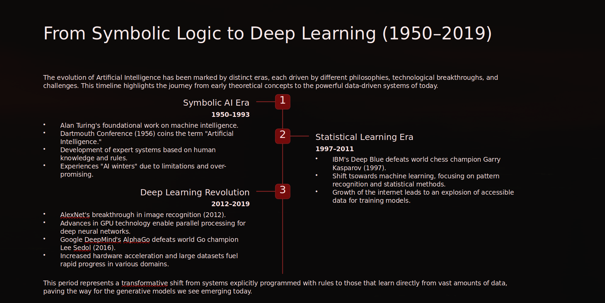

# AI Strategy: 75 Years of Evolution
> Understanding where we started to navigate where the industry is headed.

---

## Strategic Evolution Timeline

*A synthesized view of AI breakthroughs, mapping the shift from symbolic logic to creative intelligence.*

---

## Industry Perspective
| Era | Innovation | Industry Context |
| :--- | :--- | :--- |
| **Symbolic** | Rule-Based Logic | The era of "hand-coded" intelligence and theoretical foundations. |
| **Statistical** | Pattern Recognition | The shift to data-driven models and internet-scale pattern finding. |
| **Deep Learning** | Neural Networks | The breakthrough of hardware-accelerated "seeing" and "hearing." |
| **Generative** | Creative AI | The current move from machines that analyze to machines that create. |

---

## Technical Framework
* **Methodology:** Comparative analysis of 75 years of AI milestones (1950–2025).
* **Key Benchmarks:** Turing (1950), Deep Blue (1997), AlexNet (2012), GPT-4 (2023).
* **The Horizon:** Integrating 2024 regulatory trends and ethical frameworks into the development lifecycle.

---

## The Bottom Line
To understand the trajectory of modern AI, we must understand the foundations that built it. This work demonstrates the ability to contextualize current industry shifts by mapping the technical milestones that brought us here.
