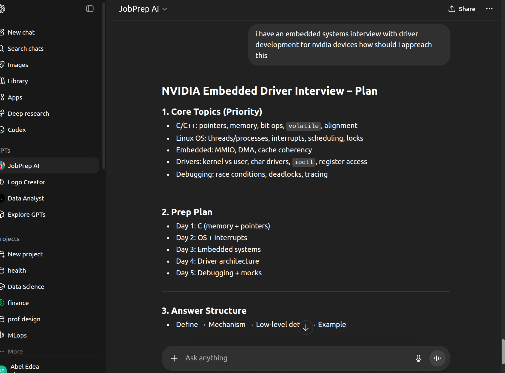

## AI Engineer | Sortera Technologies

I build production AI systems for real-time computer vision and intelligent applications.

My work focuses on turning machine learning models into reliable systems that operate in real-world environments.

---

## Featured Work

### JobPrep AI – Interview Assistant An  
AI-powered tool that simulates technical and behavioral interviews and provides structured preparation guidance.

[View Project](artifact1.html)

---

## Technical Stack

**AI & Computer Vision**
- Real-time image processing  
- Model optimization  
- C++ / Python  

**Data & Analytics**
- SQL, Excel  
- Power BI, Tableau  

**Modern AI**
- LLMs  
- Prompt engineering  
- Predictive modeling  

---

## Additional Work

### AI Strategy: 75 Years of Evolution  
Analysis of key milestones shaping modern AI systems.

[View Project](artifact2.html)
